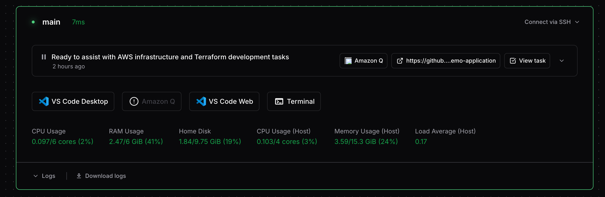

# Amazon Q

Run [Amazon Q](https://aws.amazon.com/q/) in your workspace to access Amazon's AI coding assistant. This module provides a complete integration with Coder workspaces, including automatic installation, MCP (Model Context Protocol) integration for task reporting, and support for custom pre/post install scripts.

```tf
module "amazon-q" {
  source   = "registry.coder.com/coder/amazon-q/coder"
  version  = "2.0.0"
  agent_id = coder_agent.example.id

  # Required: Authentication tarball (see below for generation)
  auth_tarball = var.amazon_q_auth_tarball
}
```



## Features

- **🚀 Automatic Installation**: Downloads and installs Amazon Q CLI automatically
- **🔐 Authentication**: Supports pre-authenticated tarball for seamless login
- **📊 Task Reporting**: Built-in MCP integration for reporting progress to Coder
- **🎯 AI Prompts**: Support for initial task prompts and custom system prompts
- **🔧 Customization**: Pre/post install scripts for custom setup
- **🌐 AgentAPI Integration**: Web and CLI app integration through AgentAPI
- **🛠️ Tool Trust**: Configurable tool trust settings
- **📁 Flexible Deployment**: Configurable working directory and module structure

## Dependencies

This module has critical dependencies on AgentAPI components for proper web integration and interactive functionality:

### AgentAPI Coder Module

- **Module**: `registry.coder.com/coder/agentapi/coder`
- **Version**: `1.1.1` (hardcoded in module)
- **Purpose**: Provides the Coder module infrastructure for AgentAPI integration
- **Functionality**: Handles module lifecycle, configuration, and Coder-specific integration

### AgentAPI Binary

- **Binary Version**: `v0.6.0` (configurable via `agentapi_version` parameter)
- **Installation**: Automatically downloaded and installed when `install_agentapi = true`
- **Purpose**: The actual AgentAPI server binary that runs the web interface
- **Functionality**: Provides the runtime server for web-based interactions

**Why Both Components are Required:**

- **Coder Module (1.1.1)**: Integrates AgentAPI into the Coder ecosystem and manages the module lifecycle
- **AgentAPI Binary (v0.6.0)**: Provides the actual web interface and interactive functionality
- **Web Interface**: Enables web-based chat interface accessible through Coder
- **Session Management**: Handles interactive sessions and maintains state
- **MCP Protocol**: Facilitates Model Context Protocol communication for task reporting
- **Real-time Updates**: Enables live progress reporting through the `coder_report_task` tool

**Version Compatibility:**

- **Module Version**: Fixed at `1.1.1` for stability and compatibility
- **Binary Version**: Configurable (default `v0.6.0`) to allow updates and customization
- **Coder Integration**: Ensure your Coder deployment supports both component versions
- **Upgrade Path**: Binary version can be updated via `agentapi_version` parameter

## Prerequisites

### System Requirements

The following tools must be pre-installed on the system where you generate the authentication tarball:

- **zstd** - Required for compressing the authentication tarball
  - **Ubuntu/Debian**: `sudo apt-get install zstd`
  - **RHEL/CentOS/Fedora**: `sudo yum install zstd` or `sudo dnf install zstd`
  - **macOS**: `brew install zstd`
  - **Windows**: Download from [zstd releases](https://github.com/facebook/zstd/releases)

### Authentication Tarball (Required)

You must generate an authenticated Amazon Q tarball on another machine where you have successfully logged in:

```bash
# 1. Install Amazon Q and login on your local machine
q login

# 2. Generate the authentication tarball
cd ~/.local/share/amazon-q
tar -c . | zstd | base64 -w 0
```

Copy the output and use it as the `auth_tarball` variable.

<details>
<summary><strong>Detailed Authentication Setup</strong></summary>

**Step 1: Install Amazon Q locally**

- Download from [AWS Amazon Q Developer](https://aws.amazon.com/q/developer/)
- Follow the installation instructions for your platform

**Step 2: Authenticate**

```bash
q login
```

Complete the authentication process in your browser.

**Step 3: Generate tarball**

```bash
cd ~/.local/share/amazon-q
tar -c . | zstd | base64 -w 0 > /tmp/amazon-q-auth.txt
```

**Step 4: Use in Terraform**

```tf
variable "amazon_q_auth_tarball" {
  type      = string
  sensitive = true
  default   = "PASTE_YOUR_TARBALL_HERE"
}
```

**Important Notes:**

- Regenerate the tarball if you logout or re-authenticate
- Each user needs their own authentication tarball
- Keep the tarball secure as it contains authentication credentials

</details>

### AI Task Integration (Required for coder_ai_task)

When using the `coder_ai_task` resource in your Coder template, you must define a `coder_parameter` named **'AI Prompt'** to enable task integration:

```tf
data "coder_parameter" "ai_prompt" {
  name         = "AI Prompt"
  display_name = "AI Prompt"
  description  = "Prompt for the AI task to execute"
  type         = "string"
  mutable      = true
  default      = ""
}

resource "coder_ai_task" "example" {
  agent_id = coder_agent.example.id
  prompt   = data.coder_parameter.ai_prompt.value
}

module "amazon-q" {
  source       = "registry.coder.com/coder/amazon-q/coder"
  version      = "2.0.0"
  agent_id     = coder_agent.example.id
  auth_tarball = var.amazon_q_auth_tarball
  ai_prompt    = data.coder_parameter.ai_prompt.value
}
```

**Important Notes:**

- The parameter name must be exactly **'AI Prompt'** (case-sensitive)
- This parameter enables the AI task workflow integration
- The parameter value is passed to the Amazon Q module via the `ai_prompt` variable
- Without this parameter, `coder_ai_task` resources will not function properly

## Configuration Variables

### Required Variables

| Variable   | Type     | Description             |
| ---------- | -------- | ----------------------- |
| `agent_id` | `string` | The ID of a Coder agent |

### Optional Variables

| Variable                 | Type     | Default                                               | Description                                                                                                                    |
| ------------------------ | -------- | ----------------------------------------------------- | ------------------------------------------------------------------------------------------------------------------------------ |
| `auth_tarball`           | `string` | `""`                                                  | Base64 encoded, zstd compressed tarball of authenticated Amazon Q directory (sensitive)                                        |
| `amazon_q_version`       | `string` | `"1.14.1"`                                            | Version of Amazon Q to install                                                                                                 |
| `q_install_url`          | `string` | `"https://desktop-release.q.us-east-1.amazonaws.com"` | Base URL for Amazon Q installation downloads (supports air-gapped installations)                                               |
| `install_amazon_q`       | `bool`   | `true`                                                | Whether to install Amazon Q CLI                                                                                                |
| `install_agentapi`       | `bool`   | `true`                                                | Whether to install AgentAPI for web integration                                                                                |
| `agentapi_version`       | `string` | `"v0.6.0"`                                            | Version of AgentAPI to install                                                                                                 |
| `trust_all_tools`        | `bool`   | `false`                                               | Whether to trust all tools in Amazon Q (security consideration)                                                                |
| `ai_prompt`              | `string` | `""`                                                  | Initial task prompt to send to Amazon Q (used for automated task execution)                                                    |
| `system_prompt`          | `string` | _See below_                                           | System prompt that defines the agent's behavior and task reporting instructions                                                |
| `coder_mcp_instructions` | `string` | _See below_                                           | Specific instructions for Coder MCP server integration. Defines task reporting format and requirements                         |
| `pre_install_script`     | `string` | `null`                                                | Optional script to run before installing Amazon Q (supports custom environment setup)                                          |
| `post_install_script`    | `string` | `null`                                                | Optional script to run after installing Amazon Q (supports custom configuration)                                               |
| `agent_config`           | `string` | `null`                                                | Custom agent configuration JSON. The "name" field is used as agent name and config filename. Supports full agent customization |

### UI Configuration

| Variable | Type     | Default                | Description                                 |
| -------- | -------- | ---------------------- | ------------------------------------------- |
| `order`  | `number` | `null`                 | Position in UI (lower numbers appear first) |
| `group`  | `string` | `null`                 | Group name for organizing apps              |
| `icon`   | `string` | `"/icon/amazon-q.svg"` | Icon to display in UI                       |

### Default System Prompt

The module includes a simple system prompt that instructs Amazon Q:

```
You are a helpful Coding assistant. Aim to autonomously investigate
and solve issues the user gives you and test your work, whenever possible.
Avoid shortcuts like mocking tests. When you get stuck, you can ask the user
but opt for autonomy.
```

### System Prompt Features:

- **Autonomous Operation:** Encourages Amazon Q to work independently and test solutions
- **Quality Focus:** Avoids shortcuts like mocking tests, promotes thorough testing
- **User Interaction:** Clear guidelines on when to ask for user input
- **Coding Focus:** Specifically designed for coding and development tasks

You can customize this behavior by providing your own system prompt via the `system_prompt` variable.

### Default Coder MCP Instructions

The module includes specific instructions for the Coder MCP server integration that are separate from the system prompt:

```
YOU MUST REPORT ALL TASKS TO CODER.
When reporting tasks you MUST follow these EXACT instructions:
- IMMEDIATELY report status after receiving ANY user message
- Be granular If you are investigating with multiple steps report each step to coder.

Task state MUST be one of the following:
- Use "state": "working" when actively processing WITHOUT needing additional user input
- Use "state": "complete" only when finished with a task
- Use "state": "failure" when you need ANY user input lack sufficient details or encounter blockers.

Task summaries MUST:
- Include specifics about what you're doing
- Include clear and actionable steps for the user
- Be less than 160 characters in length
```

### Coder MCP Instructions Features:

- **Mandatory Reporting:** Ensures all tasks are reported to Coder via the `@coder` tool
- **Immediate Response:** Status reporting triggered by any user message
- **Granular Progress:** Step-by-step reporting for multi-step investigations
- **State Management:** Clear working, complete, and failure states
- **Actionable Summaries:** Concise 160-character task descriptions
- **User Input Handling:** Clear guidelines for when user input is needed
- **Separation of Concerns:** Separate from system prompt for focused MCP behavior

### Integration with @coder Tool:

The `coder_mcp_instructions` work in conjunction with the `@coder` tool in the agent configuration:

- **Tool Permission:** The `@coder` tool must be in `allowedTools` for MCP integration to work
- **Task Reporting:** Instructions guide the agent on how to use `coder_report_task`
- **Status Updates:** Defines the format and timing of status updates to Coder
- **Error Handling:** Specifies when to report failure states and request user input

You can customize these instructions by providing your own via the `coder_mcp_instructions` variable.

## Default Agent Configuration

The module includes a default agent configuration template that provides a comprehensive setup for Amazon Q integration:

```json
{
  "name": "agent",
  "description": "This is an default agent config",
  "prompt": "${system_prompt}",
  "mcpServers": {},
  "tools": [
    "fs_read",
    "fs_write",
    "execute_bash",
    "use_aws",
    "@coder",
    "knowledge"
  ],
  "toolAliases": {},
  "allowedTools": ["fs_read", "@coder"],
  "resources": [
    "file://AmazonQ.md",
    "file://README.md",
    "file://.amazonq/rules/**/*.md"
  ],
  "hooks": {},
  "toolsSettings": {},
  "useLegacyMcpJson": true
}
```

### Configuration Details:

- **Tools Available:** File operations, bash execution, AWS CLI, Coder MCP integration, and knowledge base access
- **@coder Tool:** Enables Coder MCP integration for task reporting (`coder_report_task` and related tools)
- **Allowed Tools:** By default, only `fs_read` and `@coder` are allowed (can be customized for security)
- **Resources:** Access to documentation and rule files in the workspace
- **MCP Servers:** Empty by default, can be configured via `agent_config` variable
- **System Prompt:** Dynamically populated from the `system_prompt` variable
- **Legacy MCP:** Uses legacy MCP JSON format for compatibility

### Key Features:

- **Essential Tool Access:** File reading and Coder integration enabled by default
- **Security Focus:** Limited tool permissions by default, expandable as needed
- **Coder Integration:** Built-in support for Coder workspace integration via `@coder` tool
- **Task Reporting:** Enables automatic task progress reporting to Coder through MCP
- **Knowledge Base:** Access to workspace documentation and rules
- **Customizable:** Override via `agent_config` variable for specific requirements

You can override this configuration by providing your own JSON via the `agent_config` variable.

### Agent Name Configuration

The module automatically extracts the agent name from the `"name"` field in the `agent_config` JSON and uses it for:

- **Configuration File:** Saves the agent config as `~/.aws/amazonq/cli-agents/{agent_name}.json`
- **Default Agent:** Sets the agent as the default using `q settings chat.defaultAgent {agent_name}`
- **MCP Integration:** Associates the Coder MCP server with the specified agent name

If no custom `agent_config` is provided, the default agent name "agent" is used.

## Usage Examples

### Basic Usage

```tf
module "amazon-q" {
  source       = "registry.coder.com/coder/amazon-q/coder"
  version      = "2.0.0"
  agent_id     = coder_agent.example.id
  auth_tarball = var.amazon_q_auth_tarball
}
```

### With Custom AI Prompt

```tf
module "amazon-q" {
  source       = "registry.coder.com/coder/amazon-q/coder"
  version      = "2.0.0"
  agent_id     = coder_agent.example.id
  auth_tarball = var.amazon_q_auth_tarball
  ai_prompt    = "Help me set up a Python FastAPI project with proper testing structure"
}
```

### With Custom Pre/Post Install Scripts

```tf
module "amazon-q" {
  source       = "registry.coder.com/coder/amazon-q/coder"
  version      = "2.0.0"
  agent_id     = coder_agent.example.id
  auth_tarball = var.amazon_q_auth_tarball

  pre_install_script = <<-EOT
    #!/bin/bash
    echo "Setting up custom environment..."
    # Install additional dependencies
    sudo apt-get update && sudo apt-get install -y zstd
  EOT

  post_install_script = <<-EOT
    #!/bin/bash
    echo "Configuring Amazon Q settings..."
    # Custom configuration commands
    q settings chat.model claude-3-sonnet
  EOT
}
```

### Specific Version Installation

```tf
module "amazon-q" {
  source           = "registry.coder.com/coder/amazon-q/coder"
  version          = "2.0.0"
  agent_id         = coder_agent.example.id
  auth_tarball     = var.amazon_q_auth_tarball
  amazon_q_version = "1.14.0" # Specific version
  install_amazon_q = true
}
```

### Custom Agent Configuration

```tf
module "amazon-q" {
  source       = "registry.coder.com/coder/amazon-q/coder"
  version      = "2.0.0"
  agent_id     = coder_agent.example.id
  auth_tarball = var.amazon_q_auth_tarball

  agent_config = <<-EOT
    {
      "name": "custom-agent",
      "description": "Custom Amazon Q agent for my workspace",
      "prompt": "You are a specialized DevOps assistant...",
      "tools": ["fs_read", "fs_write", "execute_bash", "use_aws"]
    }
  EOT
}
```

### UI Customization

```tf
module "amazon-q" {
  source       = "registry.coder.com/coder/amazon-q/coder"
  version      = "2.0.0"
  agent_id     = coder_agent.example.id
  auth_tarball = var.amazon_q_auth_tarball

  # UI configuration
  order = 1
  group = "AI Tools"
  icon  = "/icon/custom-amazon-q.svg"
}
```

### Air-Gapped Installation

For environments without direct internet access, you can host Amazon Q installation files internally and configure the module to use your internal repository:

```tf
module "amazon-q" {
  source       = "registry.coder.com/coder/amazon-q/coder"
  version      = "2.0.0"
  agent_id     = coder_agent.example.id
  auth_tarball = var.amazon_q_auth_tarball

  # Point to internal artifact repository
  q_install_url = "https://artifacts.internal.corp/amazon-q-releases"

  # Use specific version available in your repository
  amazon_q_version = "1.14.1"
}
```

**Prerequisites for Air-Gapped Setup:**

1. Download Amazon Q installation files from AWS and host them internally
2. Maintain the same directory structure: `{base_url}/{version}/q-{arch}-linux.zip`
3. Ensure both architectures are available:
   - `q-x86_64-linux.zip` for Intel/AMD systems
   - `q-aarch64-linux.zip` for ARM systems
4. Configure network access from Coder workspaces to your internal repository

## Architecture

### Components

1. **AgentAPI Module**: Provides web and CLI app integration
2. **Install Script**: Handles Amazon Q CLI installation and configuration
3. **Start Script**: Manages Amazon Q startup with proper environment
4. **MCP Integration**: Enables task reporting back to Coder
5. **Agent Configuration**: Customizable AI agent behavior

### Installation Process

1. **Pre-install**: Execute custom pre-install script (if provided)
2. **Download**: Fetch Amazon Q CLI for the appropriate architecture
3. **Install**: Install Amazon Q CLI to `~/.local/bin/q`
4. **Authenticate**: Extract and apply authentication tarball
5. **Configure**: Set up MCP integration and agent configuration
6. **Post-install**: Execute custom post-install script (if provided)

### Runtime Behavior

- Amazon Q runs in the specified working directory
- MCP integration reports task progress to Coder
- AgentAPI provides web interface integration
- All tools are trusted by default (configurable)
- Initial AI prompt is sent if provided

## Troubleshooting

### Common Issues

**Amazon Q not found after installation:**

```bash
# Check if Amazon Q is in PATH
which q
# If not found, add to PATH
export PATH="$PATH:$HOME/.local/bin"
```

**Authentication issues:**

- Regenerate the auth tarball on your local machine
- Ensure the tarball is properly base64 encoded
- Check that the original authentication is still valid

**MCP integration not working:**

- Verify that AgentAPI is installed (`install_agentapi = true`)
- Check that the Coder agent is properly configured
- Review the system prompt configuration

### Debug Mode

Enable verbose logging by setting environment variables:

```bash
export DEBUG=1
export VERBOSE=1
```

## Security Considerations

- **Authentication Tarball**: Contains sensitive authentication data - mark as sensitive in Terraform
- **Tool Trust**: By default, all tools are trusted - review for security requirements
- **Pre/Post Scripts**: Custom scripts run with user permissions - validate content
- **Network Access**: Amazon Q requires internet access for AI model communication

## Contributing

For issues, feature requests, or contributions, please visit the [module repository](https://github.com/coder/registry).

## License

This module is provided under the same license as the Coder registry.

---

**Note**: This module requires Coder v2.7+ and is designed to work with the AgentAPI integration system.
